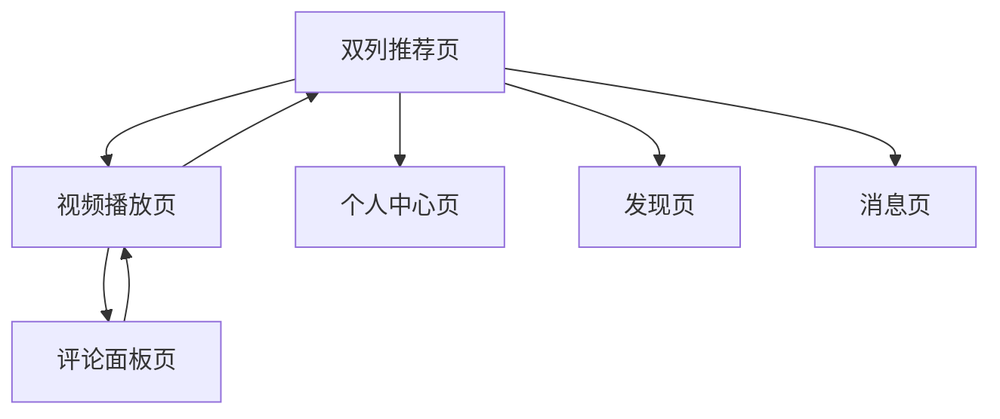

## 1. 产品概述

仿抖音短视频应用的核心功能，专注于移动端短视频浏览体验。用户可以通过双列瀑布流布局快速浏览推荐视频，点击视频封面进入单列沉浸式播放界面，享受流畅的视频观看和社交互动体验。

目标用户群体为移动端短视频消费者，提供高效的内容发现和娱乐体验，满足用户碎片化时间的内容消费需求。

## 2. 核心功能需求

### 2.1 用户角色

| 角色   | 注册方式      | 核心权限           |
| ---- | --------- | -------------- |
| 游客用户 | 无需注册      | 浏览视频、查看评论      |
| 注册用户 | 手机号/第三方登录 | 点赞、评论、分享、关注创作者 |

### 2.2 功能模块

应用主要包含以下核心页面：

1. **首页双列推荐页**：双列瀑布流视频展示、顶部导航栏、底部Tab栏
2. **视频播放页**：单列全屏播放、播放控制、互动操作栏
3. **评论面板页**：评论列表、发布评论、评论互动
4. **个人中心页**：用户信息、作品列表、设置选项

### 2.3 页面详情

| 页面名称    | 模块名称   | 功能描述                               |
| ------- | ------ | ---------------------------------- |
| 首页双列推荐页 | 双列视频网格 | 展示两列视频缩略图，每页显示6-8个视频，支持下拉刷新和上拉加载更多 |
| 首页双列推荐页 | 顶部导航栏  | 显示Logo、搜索入口、消息通知图标，支持点击跳转          |
| 首页双列推荐页 | 底部Tab栏 | 包含首页、发现、拍摄、消息、个人五个Tab，支持点击切换       |
| 首页双列推荐页 | 视频卡片   | 显示视频封面图、播放次数、点赞数、视频时长，点击进入播放页      |
| 视频播放页   | 视频播放器  | 自动播放视频，支持上下滑动切换视频，双击暂停/播放          |
| 视频播放页   | 右侧互动栏  | 显示点赞、评论、分享按钮，显示对应数量，点击触发相应功能       |
| 视频播放页   | 底部信息区  | 显示作者头像、昵称、视频描述文字，支持点击关注            |
| 评论面板页   | 评论列表   | 按时间倒序显示评论，包含用户头像、昵称、评论内容、点赞数       |
| 评论面板页   | 评论输入框  | 支持文字输入，@用户功能，表情符号，发布按钮             |
| 评论面板页   | 评论互动   | 支持点赞评论、回复评论、举报评论                   |

## 3. 核心流程

### 用户浏览流程

用户打开应用 → 进入双列推荐页 → 浏览视频缩略图 → 点击感兴趣的视频 → 进入单列播放页 → 观看视频并互动 → 滑动切换下一个视频 → 点击评论按钮 → 查看/发布评论 → 返回继续浏览

### 页面导航流程

## 4. 用户界面设计

### 4.1 设计规范

* **主色调**：抖音品牌黑色(#161823)、白色、红色(#FE2C55)

* **按钮样式**：圆形按钮，带阴影效果，点击态透明度变化

* **字体规范**：系统默认字体，标题16px，正文14px，辅助文字12px

* **布局风格**：卡片式布局，双列网格，瀑布流排版

* **图标风格**：线性图标，简洁现代，统一2px线条粗细

### 4.2 页面设计详情

| 页面名称  | 模块名称  | UI元素                                         |
| ----- | ----- | -------------------------------------------- |
| 双列推荐页 | 视频网格  | 两列布局，间距8px，视频卡片宽高比3:4，圆角12px，封面图填充整个卡片       |
| 双列推荐页 | 顶部导航  | 固定定位，高度56px，背景白色，阴影0 2px 4px rgba(0,0,0,0.1) |
| 双列推荐页 | 底部Tab | 固定定位，高度56px，背景白色，图标24px，选中状态红色填充             |
| 视频播放页 | 播放器   | 全屏显示，自动播放，加载动画，双击区域80x80px居中                 |
| 视频播放页 | 互动栏   | 右侧固定，距底部120px，按钮56x56px，间距16px，带数量显示         |
| 评论面板  | 列表项   | 头像40x40px圆形，昵称14px加粗，内容14px常规，时间12px灰色       |

### 4.3 响应式设计

* **移动端优先**：针对375px宽度设计，适配320-414px范围

* **平板适配**：横屏时显示3列视频，保持卡片比例

* **触摸优化**：按钮点击区域最小44x44px，支持滑动操作

## 5. 用户体验要求

### 5.1 交互体验

* 视频加载时间不超过2秒，支持预加载机制

* 滑动切换视频流畅无卡顿，帧率保持60fps

* 双击播放/暂停响应时间小于100ms

* 评论面板从底部滑出，动画时长300ms

* 上拉加载更多数据时显示加载动画

### 5.2 视觉体验

* 视频封面图清晰无拉伸，支持懒加载

* 夜间模式支持，自动切换或手动设置

* 无网络状态显示友好提示页面

* 加载失败时支持重试机制

* 图片加载失败显示默认占位图

## 6. 技术约束条件

### 使用Android studio开发，选用kotlin语言，使用MVVM框架，数据可以使用假数据，保证1到2屏测试即可。

## 7. 性能要求

### 7.1 启动性能

* 冷启动时间不超过3秒

* 热启动时间不超过1秒

* 首屏渲染时间小于1.5秒

* 安装包大小控制在100MB以内

### 7.2 运行性能

* 内存占用不超过300MB

* CPU使用率峰值不超过60%

* 视频播放时电池消耗优化

* 支持后台音频播放

### 7.3 网络性能

* 支持弱网环境播放，最低150kbps

* 视频清晰度自适应网络状况

* 支持离线缓存，最多缓存50个视频

* 网络切换时自动调整播放策略

### 7.4 稳定性要求

* 崩溃率低于0.1%

* ANR（应用无响应）率低于0.05%

* 支持异常捕获和上报

* 支持热修复机制

