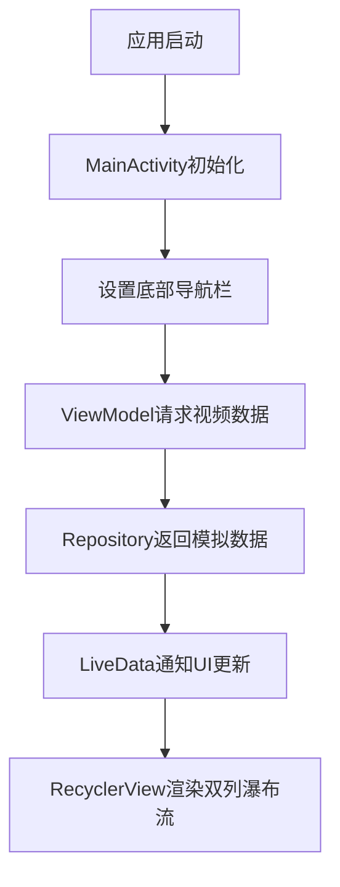
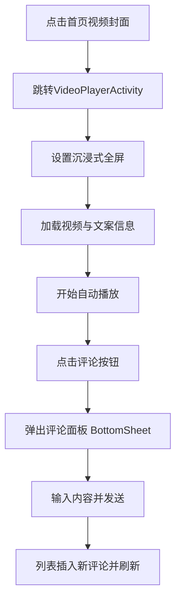

# 抖音双列页面Android应用 - 技术文档

## 1. 项目目标

### 1.1 业务目标
开发一款仿照抖音的Android移动应用，实现核心的短视频推荐和播放功能，提供流畅的用户体验和现代化的界面设计。

### 1.2 功能目标
- ✅ 双列视频推荐页面，展示视频缩略图和基本信息
- ✅ 点击封面进入单列视频播放界面
- ✅ 顶部和底部Tab导航，支持页面切换
- ✅ 视频播放控制（播放/暂停）
- ✅ 视频内流页面的转评赞UI实现
- ✅ 视频内流点击评论可以进入评论面板，支持发布一条新评论

## 2. 技术选型

### 2.1 开发语言与框架
- **Kotlin**：Google推荐的Android开发语言，简洁安全
- **Android SDK**：原生Android开发框架，性能最优
- **MVVM架构**：Model-View-ViewModel架构模式，分离关注点

### 2.2 UI框架与组件
- **XML Layout**：传统的Android布局系统，成熟稳定
- **ConstraintLayout**：灵活的约束布局，适配不同屏幕
- **RecyclerView**：高性能列表组件，支持网格布局
- **Material Design**：Google设计语言，现代化UI风格
- **BottomSheetDialogFragment**：底部弹窗组件，用于评论面板

### 2.3 架构组件
- **ViewModel**：管理UI相关数据，生命周期感知
- **Repository Pattern**：数据管理层，统一数据来源
- **Adapter Pattern**：列表适配器，连接数据和UI

## 3. 系统架构设计

### 3.1 整体架构图

```
┌─────────────────────────────────────────────────────────────┐
│                        UI Layer                             │
│  ┌──────────────┐  ┌─────────────────┐  ┌───────────────┐  │
│  │MainActivity  │  │VideoPlayerAct.  │  │CommentBottom  │  │
│  │              │  │                 │  │Sheet          │  │
│  └──────┬───────┘  └────────┬────────┘  └──────┬────────┘  │
│         │                    │                    │         │
│  ┌──────▼───────┐  ┌────────▼────────┐  ┌────────▼──────┐  │
│  │VideoGridAdp. │  │VideoPlayerLogic │  │CommentAdapter │  │
│  │              │  │                  │  │               │  │
│  └──────┬───────┘  └────────┬────────┘  └──────┬────────┘  │
└─────────┼──────────────────┼───────────────────┼───────────┘
          │                  │                   │
          ▼                  ▼                   ▼
┌─────────────────────────────────────────────────────────────┐
│                    ViewModel Layer                         │
│  ┌─────────────────────────────────────────────────────┐  │
│  │              VideoViewModel                          │  │
│  │  ┌──────────┐  ┌──────────┐  ┌──────────┐        │  │
│  │  │videos:     │  │current:   │  │loading:  │        │  │
│  │  │LiveData    │  │LiveData   │  │LiveData   │        │  │
│  │  └──────────┘  └──────────┘  └──────────┘        │  │
│  └────────────────────┬────────────────────────────────┘  │
└───────────────────────┼─────────────────────────────────────┘
                        │
                        ▼
┌─────────────────────────────────────────────────────────────┐
│                   Repository Layer                         │
│  ┌─────────────────────────────────────────────────────┐  │
│  │              VideoRepository                       │  │
│  │  ┌──────────┐  ┌──────────┐  ┌──────────┐        │  │
│  │  │Mock Data │  │Business  │  │Data Proc.│        │  │
│  │  │Generation│  │Logic     │  │          │        │  │
│  │  └──────────┘  └──────────┘  └──────────┘        │  │
│  └────────────────────┬────────────────────────────────┘  │
└───────────────────────┼─────────────────────────────────────┘
                        │
                        ▼
┌─────────────────────────────────────────────────────────────┐
│                     Model Layer                             │
│  ┌──────────┐  ┌──────────┐  ┌──────────┐  ┌──────────┐  │
│  │Video     │  │User      │  │Comment   │  │Data      │  │
│  │Entity    │  │Entity    │  │Entity     │  │Classes    │  │
│  └──────────┘  └──────────┘  └──────────┘  └──────────┘  │
└─────────────────────────────────────────────────────────────┘
```


## 4. 功能实现思路

### 4.1 双列视频推荐页面

#### 实现思路
1. **布局设计**：使用ConstraintLayout作为根布局，包含Toolbar、RecyclerView和BottomNavigationView
2. **网格展示**：RecyclerView配合StaggeredGridLayoutManager实现2列瀑布流布局
3. **数据绑定**：VideoGridAdapter将视频数据绑定到自定义的item_video_grid布局
4. **交互处理**：点击事件通过lambda表达式回调到MainActivity

### 4.2 视频播放页面

#### 实现思路
1. **全屏布局**：使用ConstraintLayout实现沉浸式全屏播放体验
2. **视频展示**：使用ImageView作为视频播放占位符（简化版本）
3. **交互区域**：右侧互动栏包含头像、点赞、评论、分享按钮
4. **信息展示**：底部区域显示作者信息、视频描述、音乐信息
5. **状态管理**：实时更新点赞状态、关注状态等用户交互

### 4.3 评论面板功能

#### 实现思路
1. **底部弹窗**：使用BottomSheetDialogFragment实现从底部滑出的评论面板
2. **列表展示**：RecyclerView展示评论列表，支持滚动加载更多
3. **评论输入**：底部输入框和发送按钮，实时提交评论
4. **交互功能**：支持评论点赞、回复等操作
5. **数据同步**：评论数据与ViewModel同步，实时更新

### 4.4 数据管理架构

#### 实现思路
1. **Repository模式**：统一数据获取接口，屏蔽数据来源差异
2. **Mock数据**：使用模拟数据进行开发和测试，不依赖网络
3. **LiveData响应**：数据变化自动通知UI更新
4. **状态管理**：统一管理加载状态、错误状态、数据状态
5. **业务逻辑分离**：ViewModel处理业务逻辑，Activity专注UI展示

## 5. 项目执行流程

### 5.1 核心业务流程图


### 5.1 视频播放与交互流程



## 6. 项目结构

```text
app/
  build.gradle.kts
  src/main/
    java/com/example/firstapplication/
      MainActivity.kt                 # 主界面：TabLayout + ViewPager2 + BottomNavigation
      VideoPlayerActivity.kt          # 单列视频内流（ExoPlayer，刷新，转场收尾）
      adapter/
        ViewPagerAdapter.kt           # 主页标签页适配器（推荐/商城）
        VideoGridAdapter.kt           # 推荐页双列网格适配器（封面共享元素名）
        VideoPlayerAdapter.kt         # 内流页适配器（容器切换、暂停图标、互动）
      fragment/
        RecommendFragment.kt          # 双列推荐页（刷新、数据订阅、点击转场）
        ShopFragment.kt               # 商城占位页
      repository/
        VideoRepository.kt            # 示例数据来源（含 raw 视频与图片）
      viewmodel/
        VideoViewModel.kt             # LiveData 状态与数据加载
      utils/
        ResourceMapper.kt             # 封面/头像资源映射、视频 Uri 解析
    res/
      layout/
        activity_main.xml             # 主界面布局（TabLayout + ViewPager2 + BottomNav）
        fragment_recommend.xml        # 推荐页：SwipeRefreshLayout + RecyclerView
        fragment_shop.xml             # 商城占位布局
        item_video_grid.xml           # 双列网格 item（自适应高度）
        activity_video_player.xml     # 播放页根（SwipeRefreshLayout + 刷新头）
        item_video_player.xml         # 单列播放 item（PlayerView + 占位图 + 暂停图标）
      menu/
        bottom_navigation_menu.xml    # 底部导航（首页/我）
      drawable/
        play_icon.xml                 # 居中播放图标（暂停时显示）
        pause_icon.xml                # 可选暂停图标（当前未启用）
        like_icon.xml, like_filled_icon.xml, comment_icon.xml, share_icon.xml
      raw/
        demo2.*                       # 示例本地视频资源
```

### 6.1 模块职责
- `MainActivity`：承载“推荐/商城”，负责底部“首页”跳转到 `VideoPlayerActivity`。
- `RecommendFragment`：双列网格、下拉刷新、视频卡片共享元素转场。
- `VideoPlayerActivity`：单例 ExoPlayer、页内切换绑定、刷新与返回。
- `VideoGridAdapter`/`VideoPlayerAdapter`：列表项渲染与交互事件分发。
- `VideoRepository`/`VideoViewModel`：数据生成与状态管理。
- `ResourceMapper`：图片资源映射与视频 Uri 解析（raw/网络）。
